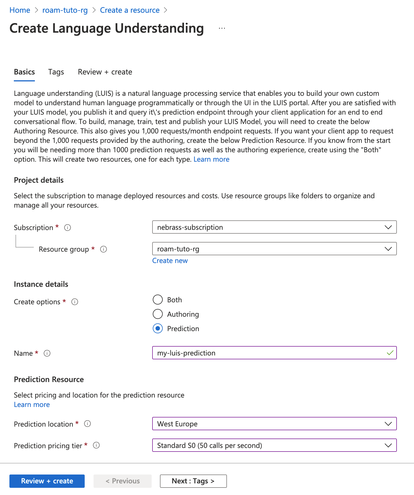

# Configuring LUIS & Speech Services

The Microsoft Azure Lanugage Understanding Service is an Azure cloud service, which provides Lanugage understanding using sophisticated AI. 

First of all, we need to create a Language Understanding resource in the Azure Portal:

Then, after creating the LUIS resource, we need to copy one of the Cognitive Service API access keys:

Then, navigate to the [LUIS console](https://www.luis.ai/), then create an authoring resource:

Next, we need to create a new Conversation app:

After creating the Conversation app, go to the **Manage** section and copy the APP ID:

Then to the **versions** screen:

Then, click on the **Import as LU** button and select the [ROS_roam.lu](./ROS_roam.lu) file. Mark the imported version as activated.

Now, go back to the **Build** section to see the imported **intents**:

Now, go to the [speech studio website](https://speech.microsoft.com/) and select **Custom Keyword** in the Voice assistant:

Then create a new project:

Then, create the first model dedicated for **invoking the robot**:

In the next step, select a prononciation and hit next to define the model type:

Then, we need to create an other model to stop the robot:

After creating the two models, we need to download the created models. To do that, click on the model and hit the **download the model**:

The downloaded Zip files contains `.table` files that you need to place them in a known location. 

Once you have completed the model, you can train and publish to a production slot. This will require you to associate the model with a prediction resource on Azure. Once that has been completed, you can configure the ROS node. 

-----
> **IMPORTANT:** a second model is needed to handle the **STOP** robot command. The Keyword created for the Stop Model will be used to immediately stop the robot.

-----

The ROS node requires the following information from the [LUIS console](https://www.luis.ai/)

> NOTE: LUIS is available as a containerized deployment: [Check instructions here.](https://docs.microsoft.com/en-us/azure/cognitive-services/luis/luis-container-howto?tabs=v3)