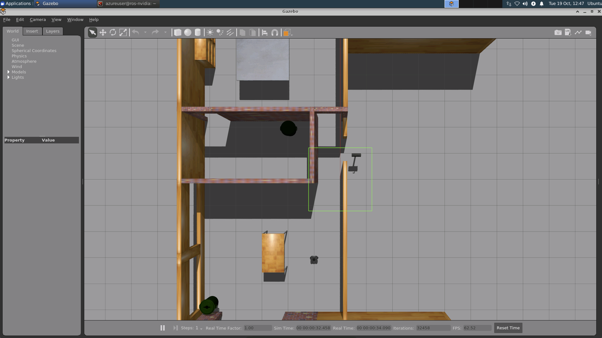
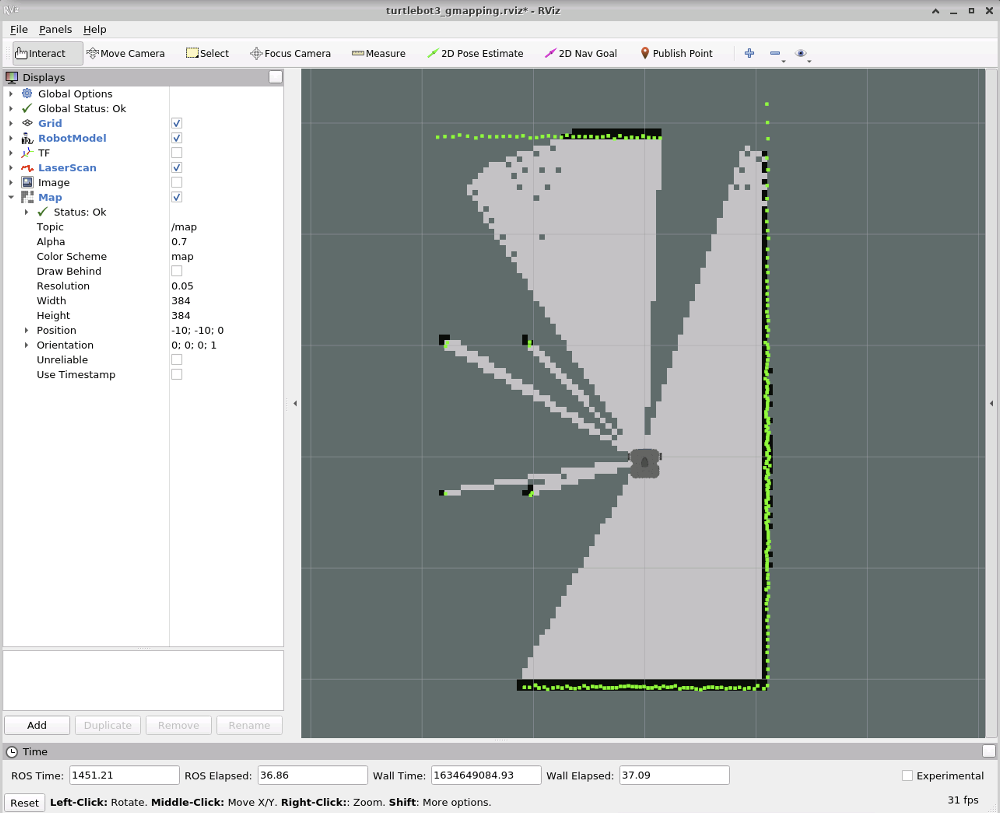
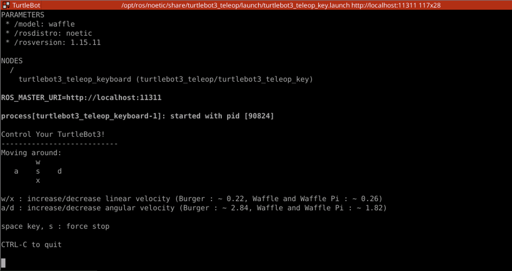
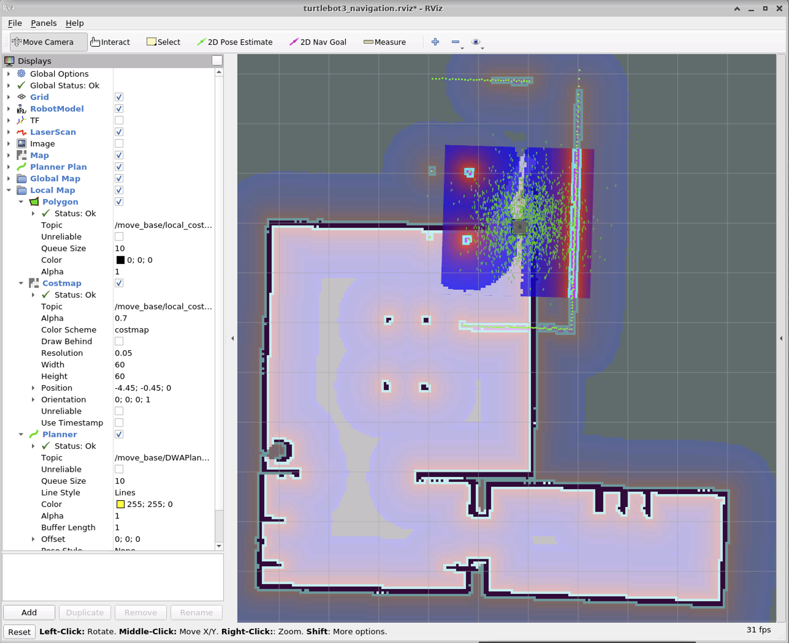
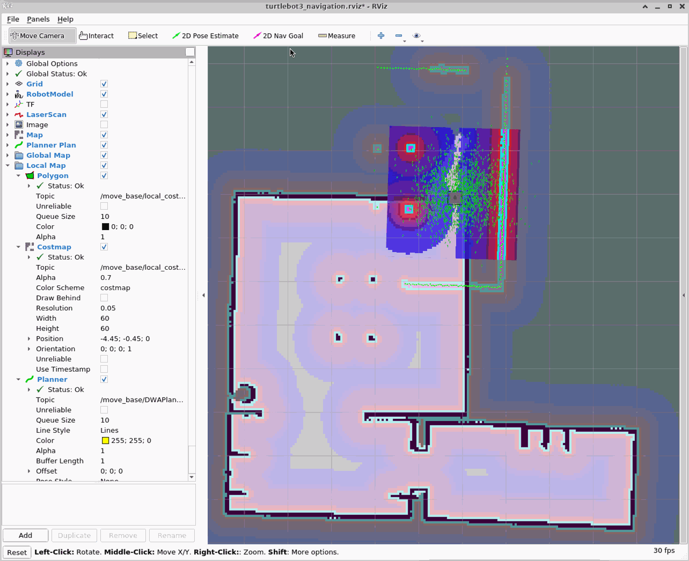

# Using the `move_base` node with Gazebo simulation

This walkthrough will show you how to simulate a robot in a Gazebo environment, and use the `ros_msft_luis` and `ros_msft_luis_move_base` nodes to control the simulated robot by voice.

We are going to use a simulated [TurtleBot3](https://emanual.robotis.com/docs/en/platform/turtlebot3/overview/) robot, and most of the steps below are actually taken from the [TurtleBot3 documentation for Gazebo simulation](https://emanual.robotis.com/docs/en/platform/turtlebot3/simulation/#gazebo-simulation). Please refer to these pages for complete instructions.

## Installing pre-requisites

Assuming you already have installed ROS on your machine, TurtleBo3 simulation requires some additional packages to be installed:

```
sudo apt-get install ros-noetic-joy ros-noetic-teleop-twist-joy \
  ros-noetic-teleop-twist-keyboard ros-noetic-laser-proc \
  ros-noetic-rgbd-launch ros-noetic-rosserial-arduino \
  ros-noetic-rosserial-python ros-noetic-rosserial-client \
  ros-noetic-rosserial-msgs ros-noetic-amcl ros-noetic-map-server \
  ros-noetic-move-base ros-noetic-urdf ros-noetic-xacro \
  ros-noetic-compressed-image-transport ros-noetic-rqt* ros-noetic-rviz \
  ros-noetic-gmapping ros-noetic-navigation ros-noetic-interactive-markers
```

Once this is done, you can install the TurtleBot3 packages:

```
sudo apt install ros-noetic-dynamixel-sdk
sudo apt install ros-noetic-turtlebot3-msgs
sudo apt install ros-noetic-turtlebot3
```

You will then proceed to download and build the TurtleBot3 simulation package. To do this, we will create a dedicated catkin workspace, clone the repo from GitHub, and run `catkin_make` to build the packages.

```
cd ~/turtlebot_ws/src/
git clone -b noetic-devel https://github.com/ROBOTIS-GIT/turtlebot3_simulations.git
cd ~/turtlebot_ws && catkin_make
source devel/setup.bash
```

Make sure to use the right branch name, corresponding to your ROS release, when cloning the repo: we are using Noetic and thus we select the corresponding branch with `-b noetic-devel`.

The last command, `source devel/setup.bash` is used to initialize your environment so that you can use the packages we just built. When opening a new window or shell, you will need to run it again so that ROS can find the packages. If you forget to run it, you will see errors similar to this:

> RLException: [turtlebot3_house.launch] is neither a launch file in package [turtlebot3_gazebo] nor is [turtlebot3_gazebo] a launch file name

Now you should be all set to launch the simulation!

## Preparing the simulation

We need to follow a few steps in order to prepare the simulation before we can use voice commands.

First, we will launch the simulation world using Gazebo. In this example, we are using the "Waffle" robot, in the "house" simulation.

```
TURTLEBOT3_MODEL=waffle roslaunch turtlebot3_gazebo turtlebot3_house.launch
```

You should see the following window appear, with our robot placed inside the simulated environment:



Now, before we can use our robot, we need it to acquire a map of its simulated environment, so it can make decisions about the best path to follow when moving around. The process of building this map is called SLAM (Simulated Localization And Mapping), and it works by moving the robot manually around the map, to give it an opportunity to scan its surroundings using a laser scanner (LIDAR).

We are going to use the SLAM node provided in the TurtleBot3 packages, by running the following command in a new shell:

```
TURTLEBOT3_MODEL=waffle roslaunch turtlebot3_slam turtlebot3_slam.launch slam_methods:=gmapping
```

It will open a new window for RViz, which is the tool that shows you what the robot is sensing about its environment. You should see the robot sitting in a room, and you can see that using its LIDAR, it has already started mapping its surroundings.



Now comes the fun part: we need to remote control the robot manually, to help it map all the parts of the house it will operate in. For this example, we don't need to map every corner of every room, but we should have at least two rooms well mapped, so we have some space to move!

In order to move the robot around, we need to run a new node (in another shell), the tele-operation node:

```
TURTLEBOT3_MODEL=waffle roslaunch turtlebot3_teleop turtlebot3_teleop_key.launch
```

This will launch a text-based controller that gives you some basic control over the robot: move forward and backward, and turn around.



Using the keys indicated, move the robot around the first room, then go on and map and couple other rooms (for example the two located south of the main room). The animation below should show you how the process looks like.


Once you are happy with your map, you can stop the tele-operation mode with Control-C, and run the following command to save the map to disk:

```
rosrun map_server map_saver -f ~/map
```

Now you can also stop the SLAM node we ran a little while ago, since we don't need it any more. In order to start from a clean state, you should also stop the Gazebo node we started first, and re-run it again in the same way, so we start from our initial world state.

We are now ready to run the navigation node! This is the node that will receive our voice-triggered commands and execute them. Note that we are passing the name of the map file we saved in the previous step, so that the robot can initialize its world map.

```
TURTLEBOT3_MODEL=waffle roslaunch turtlebot3_navigation turtlebot3_navigation.launch map_file:=$HOME/map.yaml
```

This node will also start RViz, like the SLAM node before, so we can check how our robot perceives its surroundings.



As you can see in the picture, RViz displays the map that we created via the SLAM process before. It also shows where the robot *thinks* it is located, together with a visualization of what its LIDAR is currently measuring in terms of obstacles. Unfortunately, our robot is quite lost and cannot find a good match between the map and its perception of the surroundings. Before the robot can travel within the map, we need to give it a hint about its location, using the "2D Pose Estimate" button in RViz.

Using this button, we can point on the map to where the robot is actually located and using the arrow that appears, indicate the orientation of the robot (where it is currently facing). You can find the robot's position by checking it in Gazebo.

So, here is the process:

- Switch to Gazebo and note where the robot is located (halfway between the table and the wall in our example), and its orientation (facing up in our example).
- Switch back to RViz.
- Click on the "2D Pose Estimate" button.
- Click on the position of the robot in the RViz map, *keep the mouse button pressed*
- An arrow appears; point it up by moving your mouse.
- Let go of the mouse button.

The animation below should give you an idea of the process!



Now our robot is correctly positioned on the map, and we can see that the LIDAR sensor measurements align quite well with the map (e.g. the walls and the table legs).

However, the cloud of green dots that surrounds the robot indicates that it is not yet certain of its position, but its estimation will improve as it moves around and keeps mapping its sensor inputs with the map.

If you want to try the robot navigation system now, you can do so directly from RViz, using the "2D Nav Goal" function. It works like the pose estimate: click the "2D Nav Goal" button, then click somewhere on the map, and keeping the mouse button pressed, direct the arrow in the direction you want the robot to face at the end of its movement.

At last, we are ready to give voice commands to our robot! The next time you want to start the simulation, you just need to run the Gazebo node and the navigation node. No need to run the SLAM process again or use the keyboard tele-operation.

## Using the LUIS and `move_base` nodes

Now we are ready to launch the LUIS and `ros_msft_luis_move_base_node` nodes. You should first follow the instructions about building and configuring the LUIS nodes.

```
roslaunch ros_msft_luis luis_move_base.launch
```

The LUIS node will display some instructions: (the timestamps have been removed for brevity)

```
[ INFO]: Say something starting with 'hey robot' followed by whatever you want...
[ INFO]: To immediately stop the robot, say something starting with 'stop robot'..
```

The keywords indicated are the ones you created using Speech Services Studio, and specified in the configuration, so they might be different for you.

You can now start giving voice commands to the robot, for example: "hey robot, move forward three feet".

The LUIS and `ros_msft_luis_move_base_node` nodes will then display additional logs, allowing you to follow what is happening:

```
[ INFO]: RECOGNIZING KEYWORD: Text= hey robot
[ INFO]: RECOGNIZED KEYWORD: Text= hey robot
[ INFO]: Recognizing: move
[ INFO]: Recognizing: move forward
[ INFO]: Recognizing: move forward 3
[ INFO]: Recognizing: move forward 3 feet
[ INFO]: RECOGNIZED INTENT: Text = Move forward three feet.
[ INFO]: Intent Id: Move forward
[ INFO]: JSON: {
  "query": "move forward three feet",
  "topScoringIntent": {
    "intent": "Move forward",
    "score": 0.9034695
  },
  ...
}
[ INFO]: Sending goal
[ INFO]: Goal just went active
[ INFO]: Finished in state [SUCCEEDED]
```

Here you can see that the trigger keyword "hey robot" was recognized first, then the voice command "move forward three feet" was transformed into text, and the intent recognized with a 90% probability. The intent was then sent to the `ros_msft_luis_move_base_node` node, which translated it into a goal (a position and orientation) and sent it to the navigation stack. You should see the robot move forward in Gazebo, and at the end of the movement the target position is reached, and the goal state is reported as being "succeeded".

You can try a few other commands (always preceded with the trigger keyword), like "turn left", "turn left 20 degrees", "move forward 5 meters", etc.

To stop the robot, you can use the second trigger keyword, in our example "stop robot", to stop the robot movement immediately. This is faster than saying "hey robot, stop" because there is no need to wait to translate the voice command to text and go through intent recognition; the goal is canceled as soon as the keyword is recognized.

```
[ INFO]: RECOGNIZING KEYWORD: Text= stop robot
[ INFO]: RECOGNIZED KEYWORD: Text= stop robot
[ INFO]: Canceling all goals
[ INFO]: Finished in state [PREEMPTED]
```
