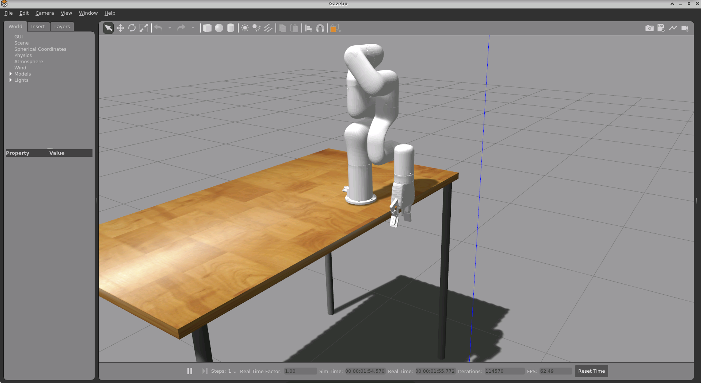
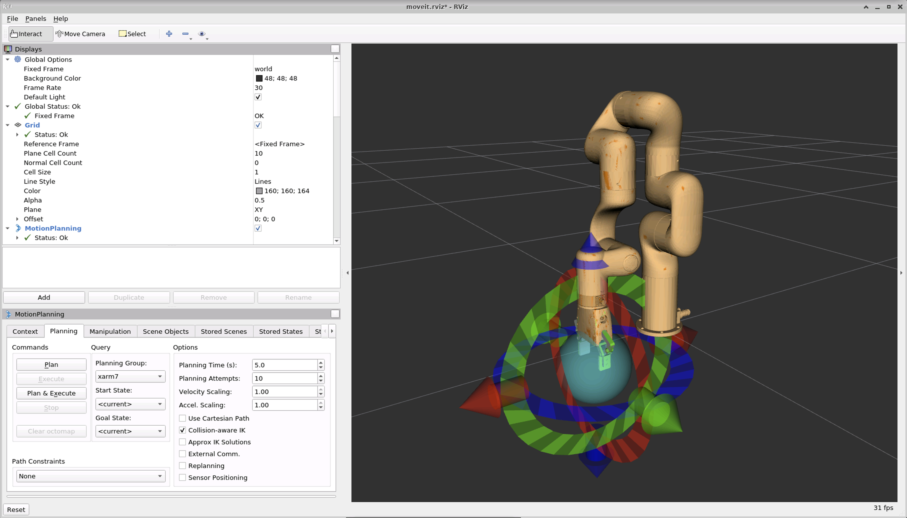

# Using the MoveIt node with Gazebo simulation

This walkthrough will show you how to simulate a robotic arm in a Gazebo environment, and use the `ros_msft_luis` and `ros_msft_luis_moveit` nodes to control the simulated robot by voice.

We are going to use a simulated [xArm robotic arm](https://www.ufactory.cc/pages/xarm), and most of the steps below are actually taken from the [xArm developer documentation](https://github.com/xArm-Developer/xarm_ros) on GitHub; please refer to these pages for complete instructions.

## Installing the pre-requisites

Assuming you have already installed ROS on your machine, the xArm simulation requires some additional packages to be installed. We are using ROS Noetic in this example, please adapt the commands if you are using a different version.

We will install install Gazebo, ROS Control, and MoveIt:

```
sudo apt-get install ros-noetic-gazebo-ros-pkgs ros-noetic-gazebo-ros-control ros-noetic-ros-control ros-noetic-moveit
```

We will then follow the instructions to download and build the xArm packages. We are going to create a new package directory called `xarm_ws` for that.

```
mkdir -p ~/xarm_ws/src
cd ~/xarm_ws/src
git clone https://github.com/xArm-Developer/xarm_ros.git --recursive
cd xarm_ros
git pull
git submodule sync
git submodule update --init --remote
```

We need to install any missing dependencies; again, change the ROS release name if you are not using Noetic.

```
rosdep update
rosdep install --from-paths . --ignore-src --rosdistro noetic -y
```

And finally, build the code:

```
cd ~/xarm_ws
catkin_make
```

As always with ROS, we need to run the following command to initialize the environment:

```
source devel/setup.bash
```

When opening a new window or shell, you will need to run it again so that ROS can find the packages. 

We are now ready to run the simulation!

## Running the simulation

Let's first run Gazebo using the following command; the `add_gripper:=true` argument indicates that we want the gripper to be attached to the arm.

```
roslaunch xarm_gazebo xarm7_beside_table.launch add_gripper:=true
```

This will open a Gazebo window showing the robotic arm placed on a table. Using the mouse, you can move the camera around to get a better view of the arm (use shift+click to rotate the view).



In a new shell, we can now run the xArm MoveIt nodes:

```
roslaunch xarm7_gripper_moveit_config xarm7_gripper_moveit_gazebo.launch
```

This will also open an RViz window, where you can interact with the robotic arm using the motion planning interface:



## Using the LUIS and MoveIt nodes

Now we are ready to launch the LUIS and `ros_msft_luis_moveit_node` nodes. You should first follow the instructions about building and configuring the LUIS nodes.

```
roslaunch ros_msft_luis luis_moveit.launch
```

The LUIS node will display some instructions: (the timestamps have been removed for brevity)

```
[ INFO]: Say something starting with 'hey robot' followed by whatever you want...
[ INFO]: To immediately stop the robot, say something starting with 'stop robot'..
```

The keywords indicated are the ones you created using Speech Services Studio, and specified in the configuration, so they might be different for you.

You can now start giving voice commands to the robot, for example: "hey robot, raise arm one foot".

The LUIS and `ros_msft_luis_moveit_node` nodes will then display additional logs, allowing you to follow what is happening:

```
[ INFO]: RECOGNIZING KEYWORD: Text= hey robot
[ INFO]: RECOGNIZED KEYWORD: Text= hey robot
[ INFO]: Recognizing: raise
[ INFO]: Recognizing: raise arm
[ INFO]: Recognizing: raise arm one
[ INFO]: Recognizing: raise arm 1 foot
[ INFO]: RECOGNIZED INTENT: Text = Raise ARM 1 foot.
[ INFO]: Intent Id: Move Arm Up
[ INFO]: JSON: {
  "query": "raise arm 1 foot",
  "topScoringIntent": {
    "intent": "Move Arm Up",
    "score": 0.9522132
  },
  ...
}
[ INFO]: Loading robot model 'xarm7_with_gripper'...
[ INFO]: Ready to take commands for planning group xarm7.
[ INFO]: Plan result: SUCCESSFUL
```

Here you can see that the trigger keyword "hey robot" was recognized first, then the voice command "raise arm one foot" was transformed into text, and the intent recognized with a 95% probability. The intent was then sent to the `ros_msft_luis_moveit_node`, which translated it into a movement and forwarded it to the MoveIt stack for execution. You should see the robotic arm execute the movement in Gazebo, and the move being reported as successful in the logs.

You can try a few other commands (always preceded with the trigger keyword), like "move arm left", "move arm forward 10 centimeters", "move arm backward", etc.

To stop the robot, you can use the second trigger keyword, in our example "stop robot", to stop the robot movement immediately. This is faster than saying "hey robot, stop" because there is no need to wait to translate the voice command to text and go through intent recognition; the movement is canceled as soon as the keyword is recognized.
